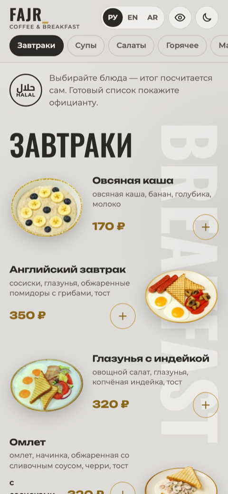
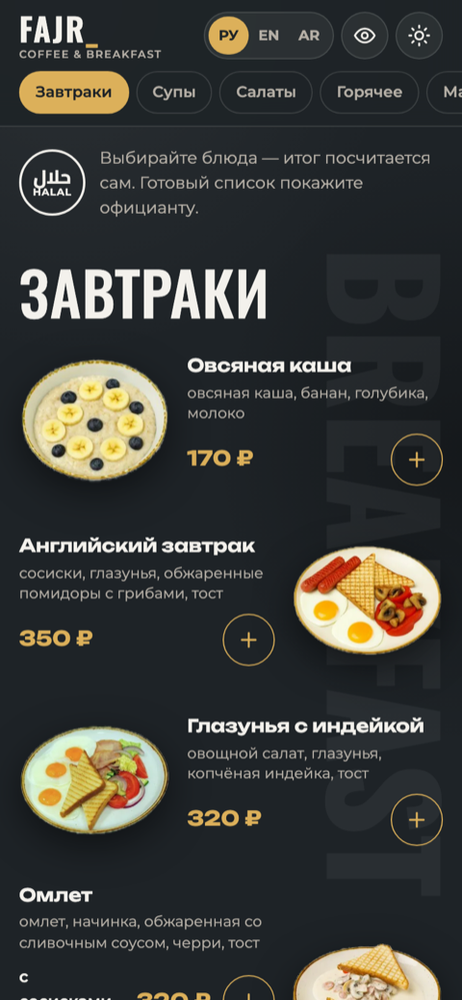
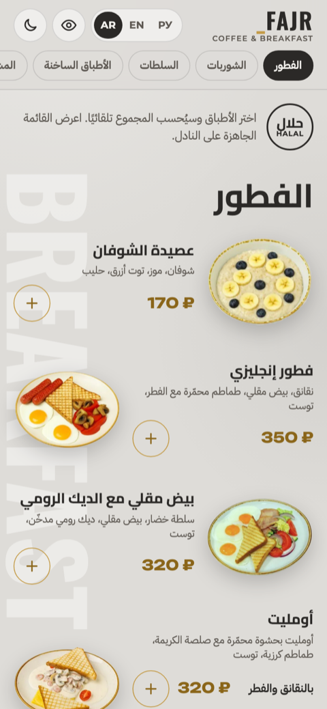
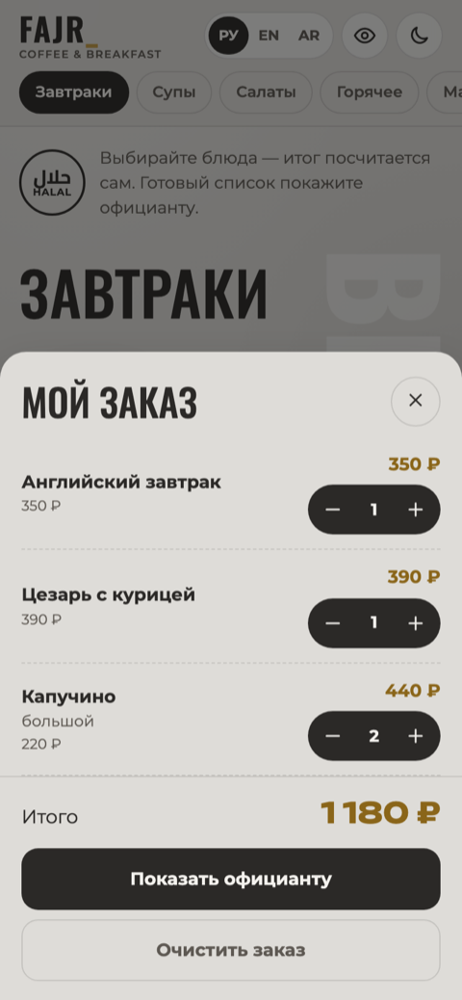

# FAJR Coffee & Breakfast — электронное меню

Меню кафе, которое открывается по QR-коду на телефоне гостя. Вариант оформления
«как в печатном меню»: светлая бумага, крупные заголовки, золотые цены.

**→ [Открыть демо](https://muhammad-al-madani.github.io/fajr-menu-classic/)**  
Второй вариант того же меню, оформленный под интерьер зала: [fajr-menu-interior](https://github.com/Muhammad-Al-Madani/fajr-menu-interior)

  
  
  
  

## Что умеет

- **Три языка — русский, английский, арабский.** Язык определяется по языку телефона,
  переключается кнопкой. Для арабского вся вёрстка разворачивается справа налево.
- **«Мой заказ».** Гость отмечает блюда, видит сумму и показывает готовый список официанту.
  Экран официанта всегда на русском, независимо от языка гостя.
- **Блюда на вес.** Мангал считается шагом 100 г с пересчётом суммы.
- **Светлая и тёмная темы** с запоминанием выбора.
- **Кнопка «скрыть цены»** — размывает все суммы, если гость смотрит меню вместе с гостями.
- **Никакого сервера.** Обычные HTML, CSS и JavaScript: кафе платит один раз, ежемесячных
  расходов на API и бэкенд нет.

## Как сделано

| | |
|---|---|
| Стек | HTML, CSS, JavaScript без фреймворков и сборки |
| Данные | всё меню — 9 разделов и 111 позиций — в одном файле `data/menu.js` |
| Языки | свой словарь в `app.js`, арабские цифры через `Intl.NumberFormat` |
| RTL | логические свойства CSS, без отдельной таблицы стилей |
| Память | язык, тема и текущий заказ хранятся в `localStorage` |
| Фото | блюда вырезаны из снимков печатного меню: Apple Vision + ручная доработка масок, на выходе WebP с прозрачностью |
| Хостинг | GitHub Pages |

## Как поменять цены и блюда

Всё меню лежит в `data/menu.js`. Цена позиции — поле `price`, у вариантов
(«малый / большой») — своё `price` внутри `variants`. Больше ничего править не нужно:
разделы, навигация и подсчёт суммы соберутся сами.

## Посмотреть у себя

Открыть `index.html` через любой локальный веб-сервер.

## Статус

Демонстрационная версия, сделанная для владельца кафе (Учкекен, ул. Ленина, 89А).
Опубликована в портфолио с его разрешения. Цены взяты с печатного меню и могут отличаться
от актуальных.
